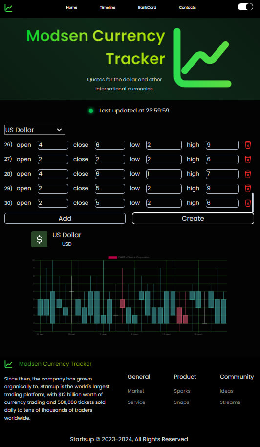

# Currency Tracker

-   Содержание
    -   [Preview проекта](#home-page)
    -   [Запуск приложения](#как-работать-с-приложением)
    -   [Особенности проекта](#о-приложении)
    -   [Полезные ссылки](#ссылки)

## Home page

## Timeline page

## Bankcard page

## Как работать с приложением

У вас должны быть установлены [зависимости проекта](#зависимости)

1. Клонирование репозитория
   `git clone https://github.com/Kovallll/modsen_currency_tracker`

2. Загрузка зависимостей `yarn install`

3. Запуск приложения `yarn start`

## О приложении

### React

В качестве основной библиотеки использовался [React](https://react.dev/)

### Типизация

В приложении в качестве типизации использовался [Typescript](https://www.typescriptlang.org/)

### Стилизация

Стилизация с помощью перпроцессора [Sass](https://sass-lang.com/) с модулями

### Тестирование

Unit тестирование реализованно с использованием [Jest](https://jestjs.io/), e2e тестирование с помошью [Cypress](https://www.cypress.io/)

### Транспилер

Преобразование современного кода JavaScript в пердыдущие стандарты было осуществленно с помощью [Babel](https://babeljs.io/)

### Сборщик

В качестве сборщика проекта был [Webpack](https://webpack.js.org/)

### Линтеры

Для анализа JS кода использовался [Eslint](https://eslint.org/), для его форматирования [Prettier](https://prettier.io/)

Для анализа и форматирования стилей использовался [Stylelint](https://stylelint.io/)

## Зависимости

Node >= 18v

## Ссылки

Мой [gitHub](https://github.com/Kovallll)
